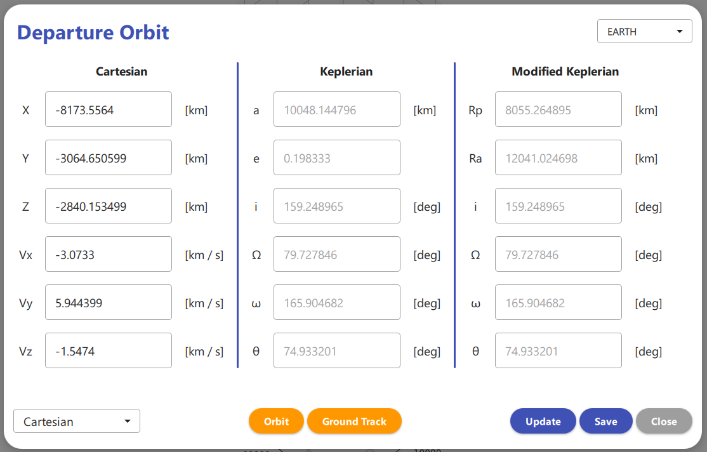

# SpacecraftSimulator

Spacecraft Dynamics And Missions Simulator

## Table Of Contents

1. Introduction
    - Languages & Libraries
    - Project's Structure
    - References
        - Books
        - GitHub Repositories
2. Departure & Arrival Orbits
3. Spacecraft Properties
4. Missions
    - Orbit Transfer
    - Interplanetary Transfer

## 1. Introduction

The `Spacecraft Simulator` application has the objective to implement all the algorithms used in **Orbital Mechanics** and integrating them inside a GUI application to simplify the ananlysis.

### 1.1 Languages & Libraries

The application is developed in `Python 3.11.2` and uses the following libraries:

- `numpy 1.24.2` for linear algebra and matrix manipulation
- `matplotlib 3.7.1` for data visualization
- `scipy 1.10.1` for numerical intergration
- `PySide6 6.7.0` for the Grafical User Interface

The front-end is developed in `Qt 6.7.0` using the `QML` language.

### 1.2 Project's Structure

The project is structured in the following folders.

- `img`: icons and images used in the GUI
- `lib`: list of external libraries
    - `lib\matplotlib_backend_qtquick`: library for integrating *matplotlib* in *QML*
- `src`: back-end of the application
- `tools`: algorithms
    - `tools\texture`: list of images for different astronomical objects
- `ui`: front-end of the application
    - `ui\components`: list of components used in the GUI
    - `ui\dialogs`: list of dialogs
    - `ui\pages`: list of pages
- `generate.bat`: batch file used to compile the file *qml.qrc* in Python
- `main.py`: root file of the project

### 1.3 References

#### Books

> **Orbital Mechanics for Engineering Students**
> - `Authors`&nbsp;&nbsp;&nbsp;&nbsp;&nbsp;Howard D. Curtis
> - `ISBN`&nbsp;&nbsp;&nbsp;&nbsp;&nbsp;&nbsp;&nbsp;&nbsp;&nbsp;&nbsp;&nbsp;9780080977485
> - `Series`&nbsp;&nbsp;&nbsp;&nbsp;&nbsp;&nbsp;&nbsp;Aerospace Engineering
> - `Year`&nbsp;&nbsp;&nbsp;&nbsp;&nbsp;&nbsp;&nbsp;&nbsp;&nbsp;&nbsp;&nbsp;2013
> - `Publisher`&nbsp;Elsevier Science
> - `URL`&nbsp;&nbsp;&nbsp;&nbsp;&nbsp;&nbsp;&nbsp;&nbsp;&nbsp;&nbsp;&nbsp;&nbsp;&nbsp;https://books.google.it/books?id=2U9Z8k0TlTYC

<!-- | Title  | Authors | ISBN | Series | Year | Publisher | URL |
| ------------- | ------------- | ------------- | ------------- | ------------- | ------------- | ------------- |
| Content Cell  | Content Cell  | Content Cell  | Content Cell  | Content Cell  | Content Cell  | Content Cell  | -->

#### GitHub Repositories

> **matplotlib_backend_qtquick**
> - `URL` https://github.com/jmitrevs/matplotlib_backend_qtquick

## 2. Departure & Arrival Orbits

Under the menu item `Missions \ Departure` it is possible to configure the **Departure Orbit**.

## 3. Spacecraft Properties

## 4. Missions

### 4.1 Orbit Transfer

### 4.2 Interplanetary Transfer