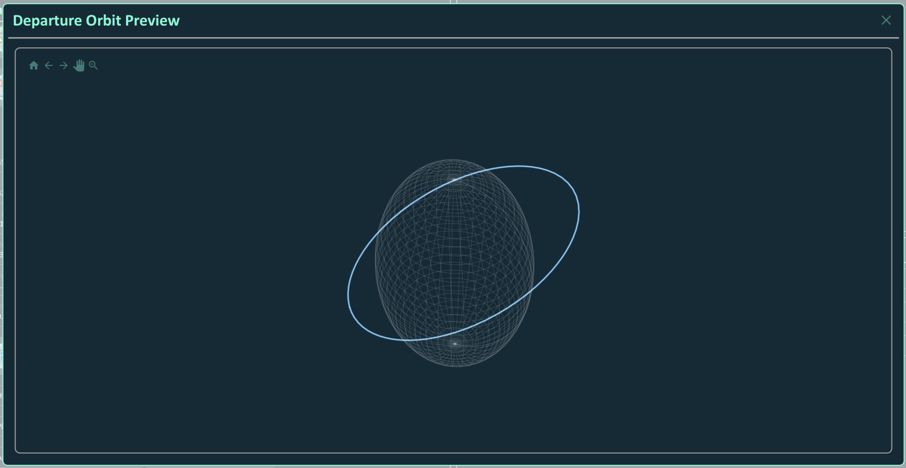
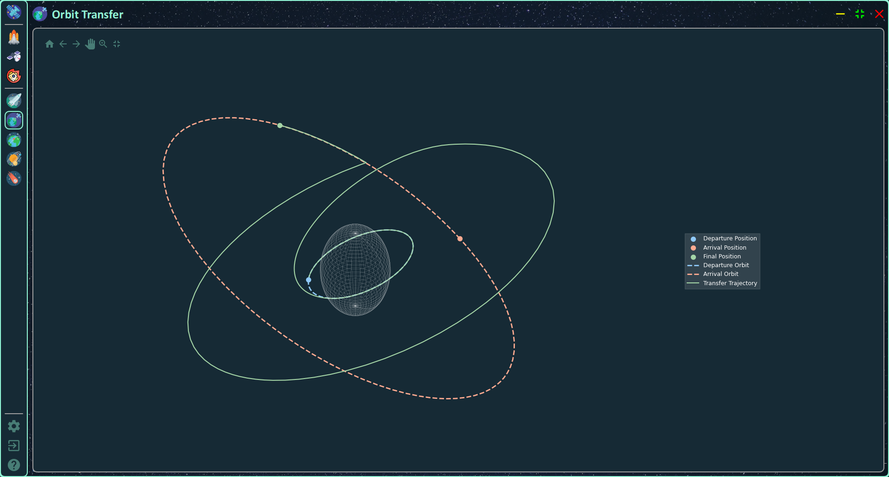
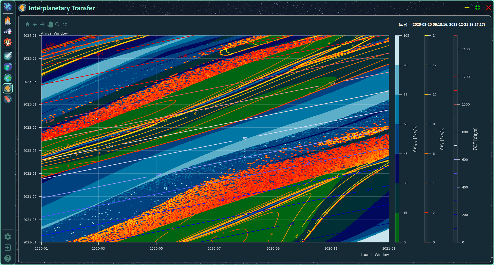

# SpacecraftSimulator

Spacecraft Dynamics And Missions Simulator

## Table Of Contents

1. Introduction
    - Languages & Libraries
    - Project's Structure
    - References
        - Books
        - GitHub Repositories
2. Departure & Arrival Orbits
3. Spacecraft Properties
4. Missions
    - Orbit Transfer
    - Interplanetary
        - Pork Chop Plot
        - Interplanetary Transfer

## 1. Introduction

The `Spacecraft Simulator` application has the objective to implement all the algorithms used in **Orbital Mechanics** and integrating them inside a GUI application to simplify the ananlysis.

### 1.1 Languages & Libraries

The application is developed in `Python 3.11.2` and uses the following libraries:

- `numpy 1.24.2` for linear algebra and matrix manipulation
- `matplotlib 3.7.1` for data visualization
- `scipy 1.10.1` for numerical intergration
- `PySide6 6.7.0` for the Grafical User Interface

The front-end is developed in `Qt 6.7.0` using the `QML` language.

### 1.2 Project's Structure

The project is structured in the following folders.

- `images`: README images
- `img`: icons and images used in the GUI
- `lib`: list of external libraries
    - `lib\matplotlib_backend_qtquick`: library for integrating *matplotlib* in *QML*
- `src`: back-end of the application
- `tools`: algorithms
    - `tools\texture`: list of images for different astronomical objects
- `ui`: front-end of the application
    - `ui\components`: list of components used in the GUI
    - `ui\dialogs`: list of dialogs
    - `ui\pages`: list of pages
- `generate.bat`: batch file used to compile the file *qml.qrc* in Python
- `main.py`: root file of the project

### 1.3 References

#### Books

> **Orbital Mechanics for Engineering Students**
> - `Authors`&nbsp;&nbsp;&nbsp;&nbsp;&nbsp;Howard D. Curtis
> - `ISBN`&nbsp;&nbsp;&nbsp;&nbsp;&nbsp;&nbsp;&nbsp;&nbsp;&nbsp;&nbsp;&nbsp;9780080977485
> - `Series`&nbsp;&nbsp;&nbsp;&nbsp;&nbsp;&nbsp;&nbsp;Aerospace Engineering
> - `Year`&nbsp;&nbsp;&nbsp;&nbsp;&nbsp;&nbsp;&nbsp;&nbsp;&nbsp;&nbsp;&nbsp;2013
> - `Publisher`&nbsp;Elsevier Science
> - `URL`&nbsp;&nbsp;&nbsp;&nbsp;&nbsp;&nbsp;&nbsp;&nbsp;&nbsp;&nbsp;&nbsp;&nbsp;&nbsp;https://books.google.it/books?id=2U9Z8k0TlTYC

<!-- | Title  | Authors | ISBN | Series | Year | Publisher | URL |
| ------------- | ------------- | ------------- | ------------- | ------------- | ------------- | ------------- |
| Content Cell  | Content Cell  | Content Cell  | Content Cell  | Content Cell  | Content Cell  | Content Cell  | -->

#### GitHub Repositories

> **matplotlib_backend_qtquick**
> - `URL` https://github.com/jmitrevs/matplotlib_backend_qtquick

## 2. Departure & Arrival Orbits

Under the menu item `Missions \ Departure` it is possible to configure the **Departure Orbit**. The same discussion is valid for the **Arrival Orbit**. The orbit can be configured using one of the following representations:
- **Cartesian** based on the *position vector* and the *velocity vector*
- **Keplerian** based on the orbital elements
    - *Semi-major axis*
    - *Eccentricity*
    - *Inclination*
    - *Right Ascension of the Ascending Node*
    - *Anomaly of the Perigee*
    - *True Anomaly*
- **Modified Keplerian** based on the following elements
    - *Periapsis Radius*
    - *Apoapsis Radius*
    - *Inclination*
    - *Right Ascension of the Ascending Node*
    - *Anomaly of the Perigee*
    - *True Anomaly*

The user can select the planet as central body. In addition, a preview of the **Orbit** and the **Ground Track** can be visioned by the available buttons.

## 3. Spacecraft Properties

Under the menu item `Missions \ Spacecraft Properties` it is possible to configure the **Spacecraft Properties** in terms of

- **Initial Mass**
- **Specific Impulse** of the propulsive system
- **Thrust** of the propulsive system

## 4. Missions

Under the menu item `Missions \ Current Mission` it is possible to select the mission to analyze:
- **Orbit Transfer** to simulate the cost in terms of $\Delta v$, $\Delta t$, and $\Delta m$ of the transfer between the departure and the arrival orbit.
- **Interplanetary Transfer** to simulate the transfer between to planets of the Solar System.

### 4.1 Orbit Transfer

Under the menu item `Missions \ Orbit Transfer` it is possible to configure the maneuvers for the transfer between the departure and the arrival orbits, among the following ones:
- **Hohmann Transfer**
- **Bi-Elliptic Hohmann Transfer**
- **Plane Change Maneuver**
- **Apse Line Rotation From Eta**

After the transfer has been evaluated, the values of $\Delta v$, $\Delta t$, and $\Delta m$ for each transfer are calculated for a detailed analysis of the cost of the transfer.

By clicking on the `Save` button, the transfer becomes visible in the main window.

### 4.2 Interplanetary

#### Pork Chop Plot

Under the menu item `Missions \ Interplanetary \ Pork Chop Plot` it is possible to analyze the cost of the interplanetary transfer bewteen two planets of the Solar System, given a *Launch Window* and an *Arrival Window*. Once selected the parameters, by clicking on the `Generate` button the Pork Chop Plot is generated, and can be seen by clicking on the `Show` button.

After the analysis of the Pork Chop Plot, under the menu item `Missions \ Interplanetary \ Interplanetary Transfer` the actual transfer can be simulated, by choosing the effective departure and arrival dates, and the departure and arrival orbits around the planets.

