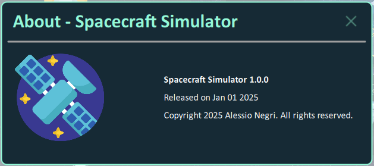
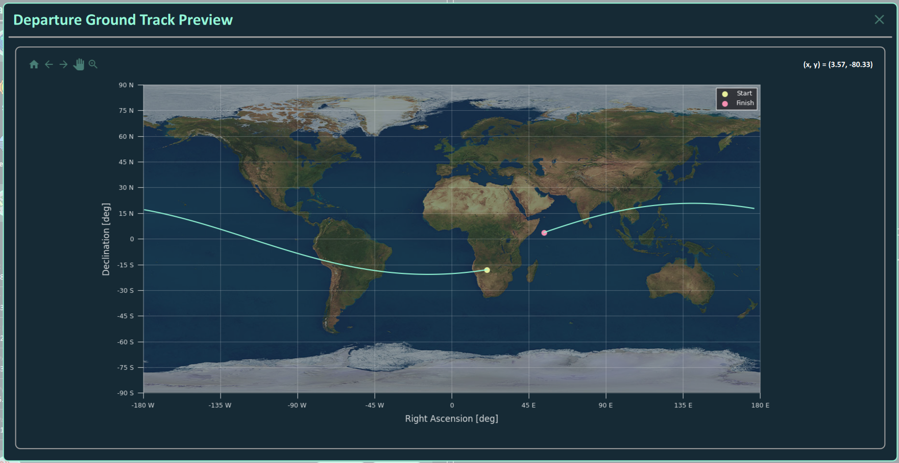

# SpacecraftSimulator

**Spacecraft Dynamics And Missions Simulator**

## 1. Introduction

The `Spacecraft Simulator` application has the objective to implement the algorithms used in **Orbital Mechanics** and **Entry Mechanics**, integrating them inside a GUI application to simplify the analysis.

I decided to adopt the *Python* language to develop all the algorithms due to the high variety of libraries for scientific applications.

For the Graphical User Interface (GUI) I decided to rely on the *QML* language (part of the *Qt* environment) due to its flexibility and the nice and modern fill it can reach.

### 1.1 Languages & Libraries

The application is developed in `Python 3.11.9` and uses the following main libraries:

- `matplotlib 3.9.2` for data visualization
- `mplcyberpunk 0.7.1` for nice matplotlib plots
- `numpy 2.0.2` for linear algebra and matrix manipulation
- `scipy 1.14.1` for numerical intergration
- `PySide6 6.8.0.2` for the Grafical User Interface
- `qbstyles 0.1.4` for nice matplotlib plots

The front-end is developed in `Qt 6.8.0` using the `QML` language.

### 1.2 Project's Structure

The project is structured in the following folders.

- `images`: README images
- `img`: icons and images used in the GUI
- `lib`: list of external libraries
    - `lib\matplotlib_backend_qtquick`: library for integrating *matplotlib* in *QML*
    - `lib\pyextrema`: library implementing Matlab extrema function
- `src`: back-end of the application
- `tools`: algorithms
    - `tools\texture`: list of images for different astronomical objects
- `ui`: front-end of the application
    - `ui\components`: list of components used in the GUI
    - `ui\dialogs`: list of dialogs
    - `ui\pages`: list of pages
    - `main.qml`: root file of the QtQuick / QML project
    - `qml.qrc`: resource file for the QtQuick / QML project
    - `qtquickcontrols2.conf`: configuration file for the QtQuick / QML project
- `generate.bat`: batch file used to compile the file *qml.qrc* in Python
- `main.py`: root file of the Python project

### 1.3 References

#### Books

> **Orbital Mechanics for Engineering Students**
> - `Authors`&nbsp;&nbsp;&nbsp;&nbsp;&nbsp;Howard D. Curtis
> - `ISBN`&nbsp;&nbsp;&nbsp;&nbsp;&nbsp;&nbsp;&nbsp;&nbsp;&nbsp;&nbsp;&nbsp;9780080977485
> - `Series`&nbsp;&nbsp;&nbsp;&nbsp;&nbsp;&nbsp;&nbsp;Aerospace Engineering
> - `Year`&nbsp;&nbsp;&nbsp;&nbsp;&nbsp;&nbsp;&nbsp;&nbsp;&nbsp;&nbsp;&nbsp;2013
> - `Publisher`&nbsp;Elsevier Science
> - `URL`&nbsp;&nbsp;&nbsp;&nbsp;&nbsp;&nbsp;&nbsp;&nbsp;&nbsp;&nbsp;&nbsp;&nbsp;&nbsp;https://www.google.it/books/edition/Orbital_Mechanics_for_Engineering_Studen/2U9Z8k0TlTYC?hl=it&gbpv=0

> **Manned Spacecraft: Design Principles**
> - `Authors`&nbsp;&nbsp;&nbsp;&nbsp;&nbsp;Pasquale M. Sforza
> - `ISBN`&nbsp;&nbsp;&nbsp;&nbsp;&nbsp;&nbsp;&nbsp;&nbsp;&nbsp;&nbsp;&nbsp;9780128044254
> - `Series`&nbsp;&nbsp;&nbsp;&nbsp;&nbsp;&nbsp;&nbsp;Aerospace Engineering
> - `Year`&nbsp;&nbsp;&nbsp;&nbsp;&nbsp;&nbsp;&nbsp;&nbsp;&nbsp;&nbsp;&nbsp;2016
> - `Publisher`&nbsp;Butterworth-Heinenmann
> - `URL`&nbsp;&nbsp;&nbsp;&nbsp;&nbsp;&nbsp;&nbsp;&nbsp;&nbsp;&nbsp;&nbsp;&nbsp;&nbsp;https://www.google.it/books/edition/Manned_Spacecraft_Design_Principles/ntWcBAAAQBAJ?hl=it&gbpv=0

<!-- | Title  | Authors | ISBN | Series | Year | Publisher | URL |
| ------------- | ------------- | ------------- | ------------- | ------------- | ------------- | ------------- |
| Content Cell  | Content Cell  | Content Cell  | Content Cell  | Content Cell  | Content Cell  | Content Cell  | -->

#### GitHub Repositories

> **matplotlib_backend_qtquick**
> - `URL` https://github.com/jmitrevs/matplotlib_backend_qtquick

> **pyextrema**
> - `URL` https://github.com/manmadan03/pyextrema

> **qbstyles**
> - `URL` https://github.com/mckinsey/qbstyles

> **mplcyberpunk**
> - `URL` https://github.com/dhaitz/mplcyberpunk

## 2. Spacecraft Properties

Under the menu item `Missions \ Spacecraft Properties` it is possible to configure the **Spacecraft Properties**.

In the **Propulsion** section you can set:

- **Initial Mass**
- **Specific Impulse**
- **Thrust**

In the **Aerodynamics** section you can set:

- **Lift Coefficient**
- **Drag Coefficient**
- **Reference Surface**
- **Radiation Pressure Coefficient** (1 => absorbing surface, 2 => reflective surface)
- **Absorbing Surface**

In the **Atmospheric Entry** section you can set:

- **Capsule** (Nose Radius - Mass - Drag / Lift Coefficients - Reference Surface)
- **Parachute** (Drag Coefficient - Reference Surface)

## 3. Missions

Under the menu item `Missions \ Current Mission` it is possible to select the mission to analyze:
- **Orbit Transfer** to simulate the cost in terms of $\Delta v$, $\Delta t$, and $\Delta m$ of the transfer between a departure and an arrival orbit.
- **Orbit Propagation** to simulate the propagation of an orbit around Earth due to perturbations.
- **Interplanetary Transfer** to simulate the transfer between two planets of the Solar System.
- **Atmospheric Entry** to simulate the re-entry of a capsule with the addition of a parachute if required.

All these missions will be discussed in detail in the following sections.

## 4 Orbit Transfer

An orbit transfer consists of a set of maneuvers to move a spacecraft from a departure orbit towards an arrival orbit. The user can decide the two orbits and the list of maneuver to simulate an orbit transfer.

### 4.1 Departure & Arrival Orbits

Under the menu item `Missions \ Orbit Transfer \ Departure Orbit` it is possible to configure the **Departure Orbit**. The same discussion is valid for the **Arrival Orbit**. The orbit can be configured using one of the following representations:
- **Cartesian** based on the *position vector* and the *velocity vector*
- **Keplerian** based on the orbital elements
    - *Semi-major axis*
    - *Eccentricity*
    - *Inclination*
    - *Right Ascension of the Ascending Node*
    - *Anomaly of the Perigee*
    - *True Anomaly*
- **Modified Keplerian** based on the following elements
    - *Periapsis Radius*
    - *Apoapsis Radius*
    - *Inclination*
    - *Right Ascension of the Ascending Node*
    - *Anomaly of the Perigee*
    - *True Anomaly*

The user can select the planet that will be considered as the central body. In addition, a preview of the **Orbit** and the **Ground Track** can be visioned by the available buttons.

### 4.2 Maneuvers

Under the menu item `Missions \ Orbit Transfer \ Maneuvers` it is possible to configure the maneuvers for the transfer between the departure and the arrival orbits, among the following ones:
- **Hohmann Transfer**
- **Bi-Elliptic Hohmann Transfer**
- **Plane Change Maneuver**
- **Apse Line Rotation From Eta**

After the transfer has been evaluated, the values of $\Delta v$, $\Delta t$, and $\Delta m$ for each transfer are calculated for a detailed analysis of the cost of the transfer. Click the `Save` button to update the parameters.

By clicking on the `Run` button, the transfer is simulated and becomes visible in the chart.

## 5 Orbit Propagation

Under the menu item `Missions \ Orbit Propagation \ Orbital Perturbations` it is possible to analyze the effects of the following perturbations on an orbit around Earth in a range of dates:
- **Drag**
- **Gravitational**
- **Solar Radiation Pressure**
- **Third Body**: the user shall select the third body between *Moon* and *Sun*

for a given set of initial orbital elements. By clicking on the `Save` button the parameters are updated.

To simulate the orbit propagation click on the `Run` button. The evolution of the orbital elements with respect to the initial values can be analyzed in the main window.

## 6 Interplanetary Transfer

One of the most interesting aspect of space is space exploration. In this section I explain how the user can simulate an interplanetary transfer.

### 6.1 Analysis

Under the menu item `Missions \ Interplanetary \ Interplanetary Transfer` it is possible to analyze/design the interplanetary transfer bewteen two planets of the Solar System, given a *Launch Window* and an *Arrival Window*. Once selected the parameters, by clicking on the `Generate` button the Pork Chop Plot is generated, and can be seen by clicking on the `Show` button. Use the `Stop` button to finish the generation before it ends.

### 6.2 Transfer

After the analysis of the Pork Chop Plot, the actual transfer can be simulated, by choosing the effective departure and arrival dates, and the departure and arrival orbits around the planets.

## 7 Atmospheric Entry

The **Atmospheric Entry** problem studies what happens when an object (e.g. capsule carrying extraterrestrial meterial) re-enters on Earth.

### 7.1 Entry Conditions

Under the menu item `Missions \ Atmospheric Entry \ Entry Conditions` it is possible to set up the parameters needed to simulate a capsule re-entry: some of the data are also present in the *Spacecraft Properties* dialog.

- **Entry Velocity**
- **Entry Flight Path Angle**
- **Entry Altitude**
- **Final Integration Time**
- **Use Parachute** to simulate the parachute deployment

Under the results section the user can analyze the **Impact Velocity** at ground.

Click the `Save` button to update the parameters.

### 7.2 Simulation

After you have decided the *Entry Conditions*, by clicking on the `Run` button, the simulation is executed and the results shown on the charts below. Each chart represents a peculiar parameter of the analysis:

- **Velocity vs Time**
- **Acceleration g's vs Time**
- **Altitude vs Downrange Distance**
- **Fight Path Angle vs Time**
- **Stagnation Point Convective Heat Flux vs Time**
- **Altitude vs Velocity**

