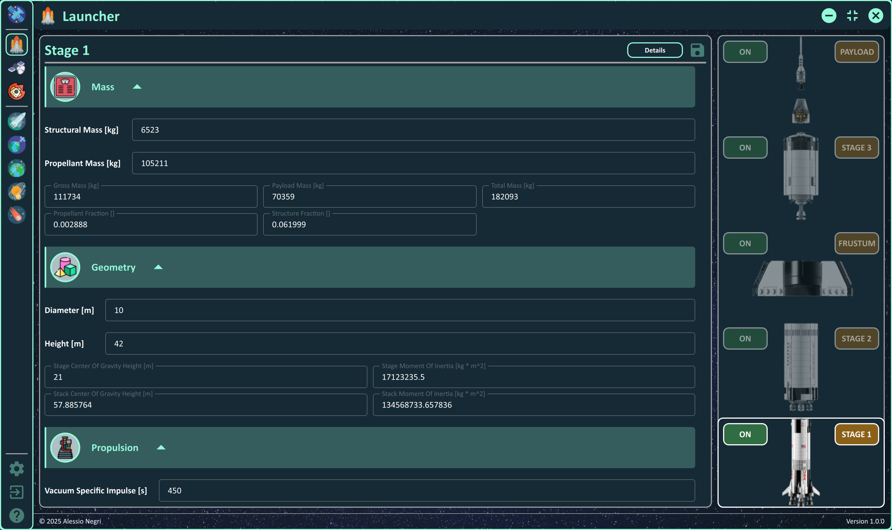
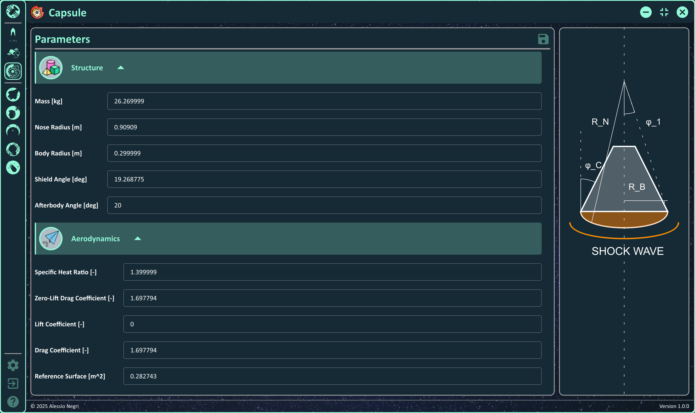
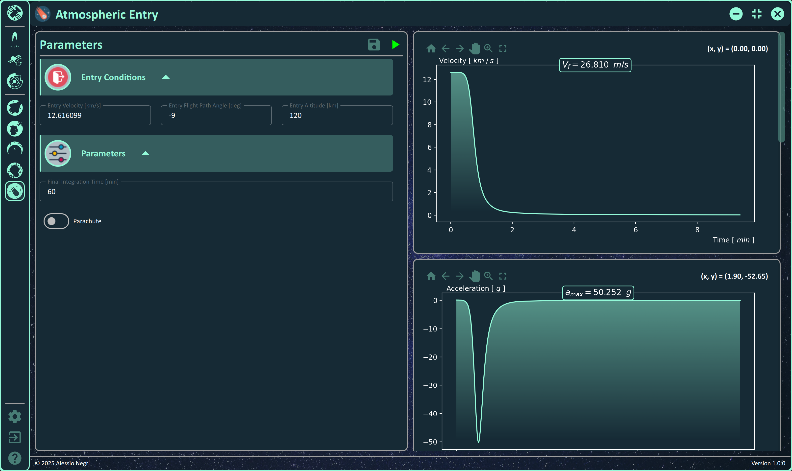
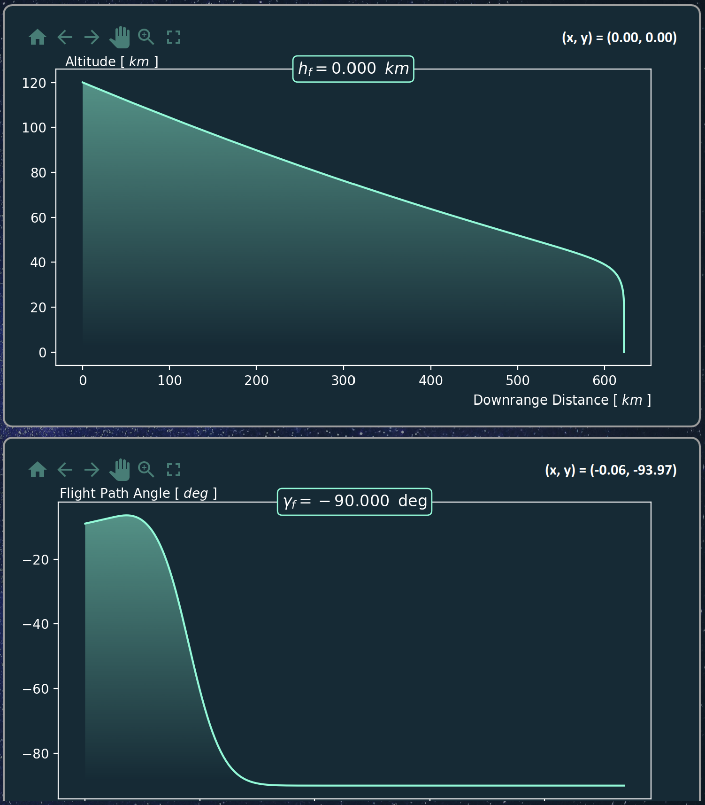

# SpacecraftSimulator 🛰️

**Spacecraft Dynamics And Missions Simulator**

## 1. Introduction 📖

The `Spacecraft Simulator` application has the objective to implement the algorithms used in **Orbital Mechanics**, **Launch Mechanics** ,and **Entry Mechanics**, integrating them inside a GUI application to simplify the analysis.

I decided to adopt the *Python* language to develop all the algorithms due to the high variety of libraries for scientific applications.

For the Graphical User Interface (GUI) I decided to rely on the *QML* language (part of the *Qt* environment) due to its flexibility and the nice and modern fill it can reach.

The **Missions** that can be simulated are the following:
- `Orbit Insertion`  
Simulate the launch phase when the spacecraft reaches the orbit from ground thanks to a launcher   
- `Orbit Transfer`  
Simulate the cost in terms of $\Delta v$, $\Delta t$, and $\Delta m$ of the transfer between a departure and an arrival orbit   
- `Orbit Propagation`  
Simulate the propagation of an orbit around Earth due to perturbations   
- `Interplanetary Transfer`  
Simulate the transfer between two planets of the Solar System   
- `Atmospheric Entry`  
Simulate the re-entry of a capsule

### 1.1 Languages & Libraries

The application is developed in `Python 3.11.9` and uses the following main libraries:

- `matplotlib 3.9.2` for data visualization
- `mplcyberpunk 0.7.1` for nice matplotlib plots
- `numpy 2.0.2` for linear algebra and matrix manipulation
- `scipy 1.14.1` for numerical intergration
- `PySide6 6.8.0.2` for the Grafical User Interface
- `qbstyles 0.1.4` for nice matplotlib plots
- `pyinstaller 6.11.1` for executable generation

The front-end is developed in `Qt 6.8.0` using the `QML` language.

### 1.2 Project's Structure

The project is structured in the following folders.

- `dist`: contains the application executable
- `images`: README images
- `img`: icons and images used in the GUI
- `lib`: list of external libraries
    - `lib\matplotlib_backend_qtquick`: library for integrating *matplotlib* in *QML*
    - `lib\pyextrema`: library implementing Matlab extrema function
- `src`: back-end of the application
    - `missions`: available missions
    - `systems`: available systems
    - `utility`: list of supporting classes
- `tools`: algorithms
    - `tools\texture`: list of images for different astronomical objects
- `ui`: front-end of the application
    - `ui\components`: list of components used in the GUI
    - `ui\dialogs`: list of dialogs
    - `ui\pages`: list of pages
    - `main.qml`: root file of the QtQuick / QML project
    - `qml.qrc`: resource file for the QtQuick / QML project
    - `qtquickcontrols2.conf`: configuration file for the QtQuick / QML project
- `generate.bat`: batch file used to compile the file *qml.qrc* in Python
- `installer.bat`: pyinstaller command for the executable creation
- `main.py`: root file of the Python project
- `SpacecraftSimulator.spec`: pyinstaller generated file

### 1.3 References

#### Books

> **Orbital Mechanics for Engineering Students**
> - `Authors`&nbsp;&nbsp;&nbsp;&nbsp;&nbsp;Howard D. Curtis
> - `ISBN`&nbsp;&nbsp;&nbsp;&nbsp;&nbsp;&nbsp;&nbsp;&nbsp;&nbsp;&nbsp;&nbsp;9780080977485
> - `Series`&nbsp;&nbsp;&nbsp;&nbsp;&nbsp;&nbsp;&nbsp;Aerospace Engineering
> - `Year`&nbsp;&nbsp;&nbsp;&nbsp;&nbsp;&nbsp;&nbsp;&nbsp;&nbsp;&nbsp;&nbsp;2013
> - `Publisher`&nbsp;Elsevier Science
> - `URL`&nbsp;&nbsp;&nbsp;&nbsp;&nbsp;&nbsp;&nbsp;&nbsp;&nbsp;&nbsp;&nbsp;&nbsp;&nbsp;https://www.google.it/books/edition/Orbital_Mechanics_for_Engineering_Studen/2U9Z8k0TlTYC?hl=it&gbpv=0

> **Manned Spacecraft: Design Principles**
> - `Authors`&nbsp;&nbsp;&nbsp;&nbsp;&nbsp;Pasquale M. Sforza
> - `ISBN`&nbsp;&nbsp;&nbsp;&nbsp;&nbsp;&nbsp;&nbsp;&nbsp;&nbsp;&nbsp;&nbsp;9780128044254
> - `Series`&nbsp;&nbsp;&nbsp;&nbsp;&nbsp;&nbsp;&nbsp;Aerospace Engineering
> - `Year`&nbsp;&nbsp;&nbsp;&nbsp;&nbsp;&nbsp;&nbsp;&nbsp;&nbsp;&nbsp;&nbsp;2016
> - `Publisher`&nbsp;Butterworth-Heinenmann
> - `URL`&nbsp;&nbsp;&nbsp;&nbsp;&nbsp;&nbsp;&nbsp;&nbsp;&nbsp;&nbsp;&nbsp;&nbsp;&nbsp;https://www.google.it/books/edition/Manned_Spacecraft_Design_Principles/ntWcBAAAQBAJ?hl=it&gbpv=0

<!-- | Title  | Authors | ISBN | Series | Year | Publisher | URL |
| ------------- | ------------- | ------------- | ------------- | ------------- | ------------- | ------------- |
| Content Cell  | Content Cell  | Content Cell  | Content Cell  | Content Cell  | Content Cell  | Content Cell  | -->

#### GitHub Repositories

> **matplotlib_backend_qtquick**
> - `URL` https://github.com/jmitrevs/matplotlib_backend_qtquick

> **pyextrema**
> - `URL` https://github.com/manmadan03/pyextrema

> **qbstyles**
> - `URL` https://github.com/mckinsey/qbstyles

> **mplcyberpunk**
> - `URL` https://github.com/dhaitz/mplcyberpunk

## 2. Systems ⚙️

From the left menu, it is possible to configure all the properties of the systems and the missions. The **systems** managed are the following:
- `Launcher`
- `Spacecraft`
- `Re-Entry Capsule`   

## 3 Orbit Insertion 🏷️

The first phase of a mission is to bring the spacecraft to space from Earth. This can be done thanks to a launcher. It is possible to simulate up to 3 **stages** in series activating them through the switch buttons. The **pitchover conditions** establish the altitude at which the rocket starts turning with a flight path angle slightly different from the 90 degress at launch. The **circular parking orbit conditions** allow the user to select the altitude of the target circular orbit, giving the value of the velocity for it.

Each stage is characterized by some parameters used by the *Calculate Staging* button to make an initial estimate for the parameters the user find on the *Launcher* page.

By clicking on the `Simulate` button, the launcher trajectory and data can be visualized and analyzed from the main window. It can be seen, from the example below, that the launcher reached the target altitude with the desired velocity, with a small flight path angle. In addition, the usage of three stages allows keeping the acceleration at small values.

## 4 Orbit Transfer 🏷️

An orbit transfer consists of a set of maneuvers to move a spacecraft from a departure orbit towards an arrival orbit. The user can decide the two orbits and the list of maneuver to simulate an orbit transfer.

### 4.1 Celestial Body

First choose among the given celestial bodies.

### 4.2 Departure & Arrival Orbits

The second step consists of configuring the **Departure Orbit** and **Arrival Orbit**. The orbits can be configured using one of the following representations:  
- **Cartesian** based on the *position vector* and the *velocity vector*   
- **Keplerian** based on the orbital elements   
    - *Semi-major axis*
    - *Eccentricity*
    - *Inclination*
    - *Right Ascension of the Ascending Node*
    - *Anomaly of the Perigee*
    - *True Anomaly*
- **Modified Keplerian** based on the following elements   
    - *Periapsis Radius*
    - *Apoapsis Radius*
    - *Inclination*
    - *Right Ascension of the Ascending Node*
    - *Anomaly of the Perigee*
    - *True Anomaly*

A preview of the **Orbit** and the **Ground Track** can be visioned by clicking on the available buttons.

### 4.3 Maneuvers

At this point it is possible to configure the maneuvers for the transfer between the departure and the arrival orbits, among the following ones:
- **Hohmann Transfer**
- **Bi-Elliptic Hohmann Transfer**
- **Plane Change Maneuver**
- **Apse Line Rotation From Eta**

After the transfer has been evaluated, the values of $\Delta v$, $\Delta t$, and $\Delta m$ for each transfer are calculated for a detailed analysis of the cost of the transfer.

By clicking on the `Simulate` button, the transfer is simulated and becomes visible in the chart.

## 5 Orbit Propagation 🏷️

In the Orbit Propagation mission it is possible to analyze the effects of the following perturbations on an orbit around Earth in a range of dates:
- **Drag**
- **Gravitational**
- **Solar Radiation Pressure**
- **Third Body**: the user shall select the third body between *Moon* and *Sun*

for a given set of initial orbital elements.

By clicking on the `Simulate` button, you can simulate the orbit propagation. The evolution of the orbital elements with respect to the initial values can be analyzed in the main window.

## 6 Interplanetary Transfer 🏷️

One of the most interesting aspect of space is space exploration. In this section I explain how the user can simulate an interplanetary transfer.

### 6.1 Analysis

Under the section `Interplanetary Transfer` it is possible to analyze/design the interplanetary transfer bewteen two planets of the Solar System, given a *Launch Window* and an *Arrival Window*. Once selected the parameters, by clicking on the `Generate` button the Pork Chop Plot is generated, and can be seen int the bottom right figure. Use the `Stop` button to finish the generation before it ends.

This is a Pork Chop Plot between *Earth* and *Mars*.

### 6.2 Transfer

After the analysis of the Pork Chop Plot, the actual transfer can be simulated, by choosing the effective departure and arrival dates, and the departure and arrival orbits around the planets. The following is a simulation for a tansfer between *Earth* and *Mars*.

## 7 Atmospheric Entry 🏷️

The **Atmospheric Entry** problem studies what happens when an object (e.g. capsule carrying extraterrestrial meterial) re-enters on Earth.

### 7.1 Entry Conditions

Under the section `Atmospheric Entry` it is possible to set up the parameters needed to simulate a capsule re-entry: some of the data are also present in the *Capsule* section. The user can activate / deactivate the usage of the parachute. Under the results sub-section the user can analyze the **Impact Velocity** at ground.

### 7.2 Simulation

After you have decided the *Entry Conditions*, by clicking on the `Simulate` button, the simulation is executed and the results shown on the charts below. Each chart represents a peculiar parameter of the analysis:

- **Velocity vs Time**
- **Acceleration g's vs Time**
- **Altitude vs Downrange Distance**
- **Fight Path Angle vs Time**
- **Stagnation Point Convective Heat Flux vs Time**
- **Stagnation Point Radiative Heat Flux vs Time**
- **Altitude vs Velocity**

